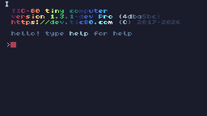
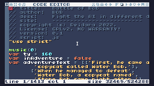
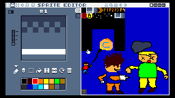
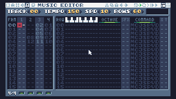
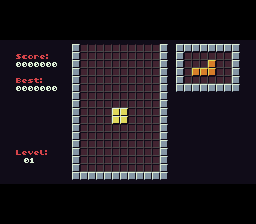

# TIC-80 for MiSTer

A community **TIC-80 Studio and cartridge-player core** for MiSTer FPGA.
The DE10-Nano ARM CPU runs TIC-80; the FPGA handles video, stereo audio,
controller transport and MiSTer OSD integration. The architecture and launcher
arrangement follow [MiSTer PICO-8](https://github.com/MiSTerOrganize/MiSTer_PICO-8).

**Development preview:** the Frontier installer preserves your shared MiSTer
executable. Complete runtime qualification with stock Main is still pending.
The working prototype's hardware results used its experimental companion Main;
those results do not establish compatibility of this preview with every stock
installation. See [tested scope and remaining work](docs/stock-main.md).

## Install

1. Download **TIC80-Frontier-v0.1.0-dev.20261005.zip** from the
   [releases page](https://github.com/kandowontu2/MiSTer_TIC-80/releases).
2. Extract it to the root of your MiSTer SD card (`/media/fat`).
3. Load MENU, then run **Install_TIC80** from the Scripts menu.
4. Select **TIC80** from the cores menu. Studio starts automatically.
5. Put `.tic` and TIC-80 cartridge `.png` files in `games/TIC-80/Carts/`.

Our installer verifies the bundle, installs the core and ARM programs, and
sets up the same shared Frontier launcher used by PICO-8. It reuses an existing
Frontier installation, preserves cartridges/saves/settings, creates update
backups, and supports rollback. No replacement MiSTer executable is included.
The offline ZIP needs no GitHub token or downloader configuration.

[Full installation and rollback instructions](docs/install.md) ·
[Usage and troubleshooting](docs/usage.md) · [Build from source](docs/building.md)

## Screenshots

The editor views are actual MiSTer video-pipeline captures, displayed larger for
readability. The clean startup console is an actual desktop Studio render with
modeled DDR transport. The Tetris shot comes from an earlier hardware prototype.
These images are not proof of stock-Main qualification or photographs of HDMI.

**Studio startup console — desktop render**

**Code editor**

**Sprite editor**

**Music editor**

**Tetris gameplay — earlier hardware prototype**

Capture origins and hashes are in [the screenshot manifest](docs/images/capture-manifest.json).

## Controls and frontends

| Xbox control | Default TIC-80 action |
| --- | --- |
| D-pad | Directions |
| Face buttons | Z/X/A/S |
| Left analogue stick | W/A/S/D |
| Start / Back | Enter / Esc |
| LB / RB | Q / E |

The remapper names Z/X/A/S, W/A/S/D, Enter, Esc and Q/E individually. Q/E can
also be mapped to LT/RT. Keyboard and mouse input are supported. For all control
details, see [usage](docs/usage.md#controls).

Studio is the default. To choose the cartridge-only player, put `player` in
`games/TIC-80/frontend.txt`, then leave and re-enter the core. Put `studio` there,
or remove that optional file, to return to Studio. Saves are in `saves/TIC-80`;
logs are in `logs/TIC-80`. Existing frontend selection is preserved on install.

## Tested scope

The matched development prototype passed both frontends' ten-minute stereo
music/save/memory checks, fourteen languages across three cartridge formats,
and physical Xbox, mouse and Bluetooth-keyboard diagnostics. Standard HDMI
720p/60 was confirmed on the test TV. The installer has thirteen local
installer/package checks and a read-only bundle check on the MiSTer.

Pending work includes complete stock-Main startup/reset/source-save behavior
and a per-core horizontal-wheel replacement, broader Studio/cart/API coverage,
Bluetooth power-cycle/multi-controller coverage, CRT, physical microphone/FFT,
SD power-loss durability, and complete external timing/latency qualification.
See [release status](docs/release-status.md), [validation](docs/validation.md),
and the [detailed development record](DEVELOPMENT.md). This preview is not a
finished universal-compatibility release.

## Credits and license

TIC-80 is by **Vadim Grigoruk (nesbox) and contributors**. This port builds on
**MiSTerOrganize's PICO-8 and Frontier work**, **Sorgelig and MiSTer contributors**,
and the many interpreter/library authors listed in [full credits](CREDITS.md).
Project direction and hardware testing are by **kando**; integration development
used **OpenAI Codex** assistance.

Original integration contributions are **GPL-3.0-or-later**. Upstream code keeps
its original license and copyright notices. [NOTICE](NOTICE), [LICENSE](LICENSE)
and [third-party notices](licenses/) accompany the release. A corresponding-source
archive supplies the integration, pinned runtime/dependencies and FPGA source
project. No proprietary PICO-8 binary or commercial cartridge bundle is included.
